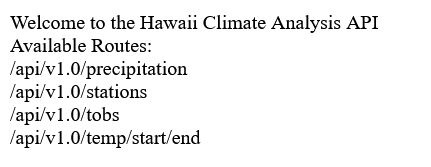
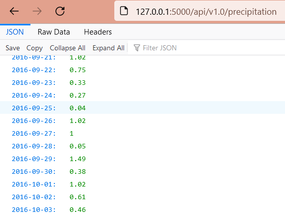
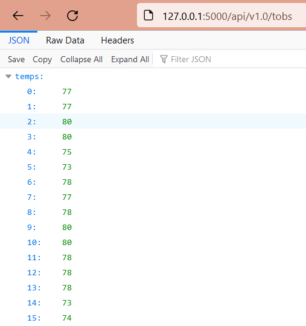
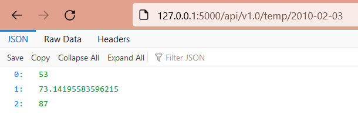
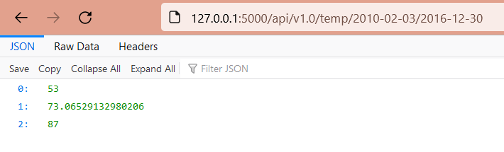
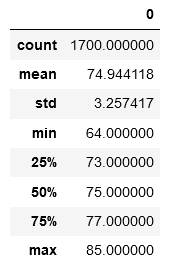
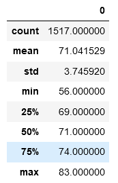

# Surfs_up - Weather Data Analysis

### Overview
This project performed an analysis of weather in Hawaii, as reported by a collection of weather stations around the state.  The weather data would be used to enable investors to decide whether to help fund a new business venture.

A Jupyter Notebook was created to collect and analyze temperature data for the months of June and December.  This would help inform the investors about the year-round feasibility of the proposed business.

### Methodology
A sqlite database containing the weather observations was examined by using Python, Sqlalchemy, Flask, and a Jupyter Notebook with Pandas.

### Flask application
A flask application was built to allow the investment team to view the weather data in a simple fashion.  All they required was the URL for the webserver, and they could then view the data.

#### Welcome Page
This is the Flask app welcome page:

From here, the investors can copy and paste the data topic into the URL and navigate to the desired page.

#### Precipitation Page
This page displays the precipitation data:

#### Stations Page
This page displays the weather stations that are reporting the weather conditions:

[Flask Stations Page](Resources/flask_stations.png)

#### Temperature Observations Page
This page displays the temperature observation data:

#### Temperature Exploration Page
This page displays the Minimum, Maximum, and Average temperature for a single date, or a range of dates.

Data displayed for a single date:

Data displayed for a date range:

## Results
The Jupyter Notebook analysis revealed the following information for "June", across several years:

And also, the following information for "December", across several years:

### Conclusions
The temperature in Hawaii is very stable when comparing Summer to Winter temperatures.

* There is only a five degree difference between the minimum temperatures.
* There is only a two degree difference between the maximum temperatures.
* The temperature observations have very similar distributions - with standard deviations (3.xxx) that begin to vary in the decimal values.

This is useful information, but more weather data analysis is recommended.

## Recommendations for Further Analysis
The following recommendations are provided to ensure complete and accurate information is available to facilitate the investor decision-making process.

### Short-Term

### Longer-Term
* Additional weather data should be collected during "December" to ensure there is equal or nearly-equal amounts of data for the seasonal comparisons.
https://github.com/AndrewZinc/Surfs_up/blob/main/Resources/flask_start.png